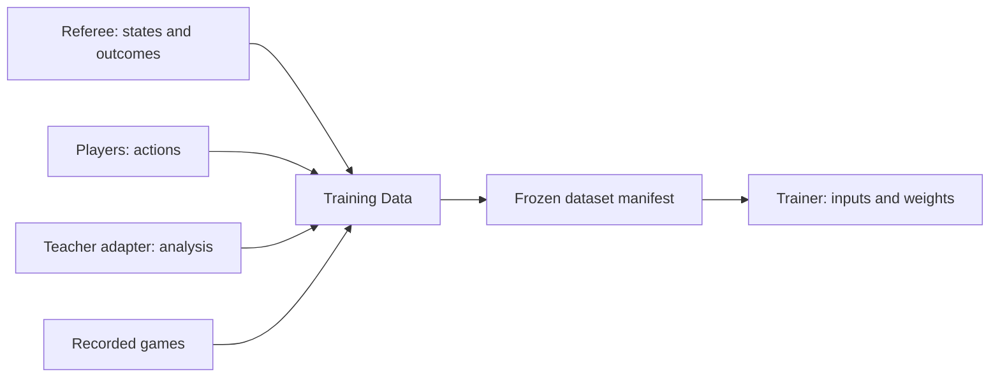

# Core model

This is the accepted architectural model. The first Training Data slice is
implemented in `src/qi/training_data/`; its README owns executable formats and
policy details. `src/qi/training_data/v1.py` owns the supported v1 artifact format. [ADR-0004](adr/0004-training-data-bounded-context.md)
records the boundary decision. The [glossary](glossary/ddd.md) owns terminology.

## Ownership

The referee owns legality, state transitions and terminal outcomes. Players
choose actions. Training Data owns example selection, supervision provenance
and dataset composition. Trainers prepare model inputs and update weights.
Evaluation owns held-out measurement and comparison recipes.

Training Data is one bounded context with four internal responsibilities:

| Responsibility | Owns |
| --- | --- |
| Trajectory source | Produce or replay games with actor and source provenance. |
| Position sampler | Select positions under explicit conditions and budgets. |
| Supervision provider | Produce targets with their specification and answer authority. |
| Dataset assembly | Mix, split, deduplicate, validate and freeze selected examples. |

Random, teacher-guided and learner-driven play use continuations with different
move choosers; recorded games supply a replay source. Who plays an action and
who supplies its target are independent. Teacher analysis may be reused only
when its state and supervision specification match the requested label.
Generation-time teacher access does not grant evaluated players tool access.

## Player configuration and identity

The player model includes a named **Player binding**: a local
configuration selecting one implementation and any checkpoint or external-engine
resources. Each participant resolves its binding independently and pins the
content identities used by its decisions. Two bindings may select the same
implementation with different weights; a display name or binding ID is not a
content fingerprint. [ADR-0006](adr/0006-independent-player-bindings.md) owns the
trade-off, and [AB-ENGINE-005](../records/work-items/items/AB-ENGINE-005-independent-checkpoints.md)
owns shared checkpoint binding implementation.

Independent participant configuration is implemented alongside the convenience
process-configured policy checkpoint. The [player guide](../src/qi/players/README.md)
owns the executable configuration contract.
Pikafish may explicitly occupy a participant's role through an adapter, while
teacher access is not granted to other players. The referee retains legality
and outcome authority; engine-native work and scores keep their own semantics.
Saved decisions retain resolved configuration and identity, so later binding
changes cannot rewrite their meaning. Pure evidence validation does not load
models or execute engines.

## Addressable situations

Starting position, game phase, theme, optional objective, generation mode and
sampling window are separate dimensions. A recipe can combine them without
introducing a new generator implementation for every combination.

- Initial support uses replay-backed starting positions. Diagram-only states
  require a later snapshot/referee contract with explicit unavailable-history
  semantics; a supplied diagram must not acquire invented history.
- Game phase uses a named, versioned board-feature policy, with recorded curated
  classifications and an unknown category. Ply number remains a separate filter.
  No numeric phase thresholds were selected by this architecture decision.
- A scenario identifies positions and tags and may declare an objective and
  answer authority. Teacher preferences, demonstrated moves and referee-proven
  solutions remain distinct. A truncated continuation supplies no terminal result.
- Continuation limits and sampling conditions are independent. Crossing a phase
  boundary need not end a trajectory; budgets declare additional plies, selected
  positions and compute separately.

## Composition and isolation

Retain reusable labeled examples, then materialize a frozen selection manifest.
Mixture quotas count retained unique examples, each assigned to one explicit
quota bucket. Descriptive tags may overlap; they do not double-count quotas.
Recipes must resolve overlapping bucket membership explicitly and reproducibly.
Record requested and achieved counts. Preserve partial work and report shortfalls
without redistributing missing quotas silently. An incomplete recipe must not be
consumed as the requested complete training dataset.

Initially, a dataset can mix generation modes while retaining one target contract
and teacher recipe. Ambiguous duplicate targets are rejected, not silently chosen
or averaged. Alternative analyses can remain in the reusable record collection.

Variations and continuations of one recorded game or curated scenario remain in
one source family and one split. Repeated use of a classical starting position
does not create an independent evaluation family. Independently generated games
sharing the standard initial board are separate families. Observation-overlap
checks apply in addition to family splitting, including reserved history prefixes.

Training and evaluation share slice vocabulary, but keep held-out source families
separate. Coverage and results by declared slice are required. Hold the evaluation
mixture fixed when comparing training recipes; overlapping diagnostic slices are
not additive quota buckets.

## Identity

| Fingerprint | Canonical identity content | Role |
| --- | --- | --- |
| State fingerprint | Ruleset, starting state and full recorded history. | Exact replay identity. |
| Observation fingerprint | Observation scheme/version and exposed model input. | Model-visible equality and leakage checks. |
| Example fingerprint | State fingerprint, supervision specification and target. | Reference a particular labeled example. |
| Dataset fingerprint | Frozen manifest: selected example references, membership/order, splits, buckets, recipe/seed and governing policy versions. | Reference exact dataset composition. |

Use versioned, canonical identity payloads and SHA-256. Incidental timestamps and
elapsed times belong in run evidence, outside semantic identity. Keep the actual
records addressable alongside fingerprints. Scenario/recipe names are logical
identifiers; a reproducible run resolves them to explicit versions or fingerprints.
Preserve contributing source lineage when reusing an identical labeled example.

Existing `state_hash`, `input_sha256` and dataset digest fields keep their current
contracts until an explicit format migration. Current dataset digests include
teacher timing and therefore are not the proposed frozen-manifest fingerprint.

## Implementation route

The [first build slice](../records/work-items/items/AB-DATA-002-first-training-data-slice.md)
implements the boundary with existing random generation, teacher-guided
continuations and a two-mode frozen mixture. Learner-driven generation,
recorded-game ingestion, heterogeneous supervision and dynamic training curricula
remain later extensions. Package layout, phase thresholds and initial mixture
percentages are implementation/experiment choices, not additional locked claims.

## Experiment knowledge

An experiment tests a question through one or more concrete executions. Its owning
work item or report retains the authored finding, conditions, limits and decision;
run artifacts retain measured evidence and execution provenance. A catalog entry
links these without acquiring their authority. CLI/API discovery and the shared
dashboard are projections of the same entries, including missing or unsupported
local evidence. Execution completion, conclusion and evidence availability are
independent. Prior-experiment links state what a follow-up extends, reproduces,
challenges or uses. [ADR-0007](adr/0007-experiment-recall-and-evidence.md) owns this
boundary; the [method](experiments.md) and [module](../src/qi/experiments/README.md)
own workflow and executable schema respectively.
